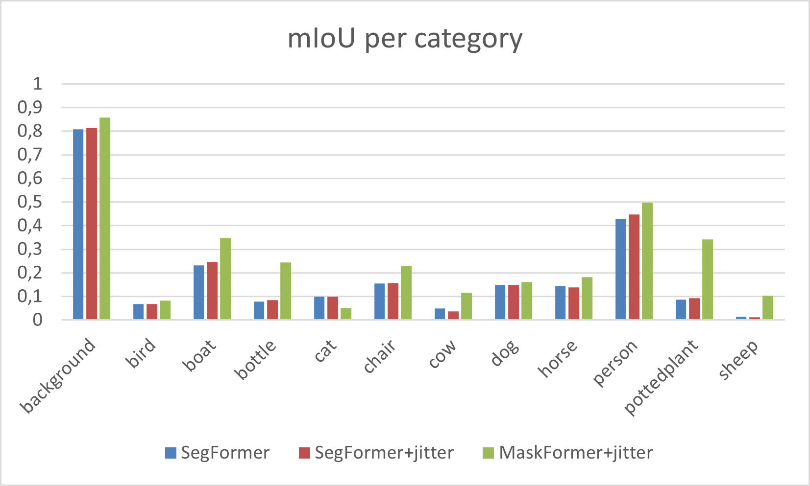
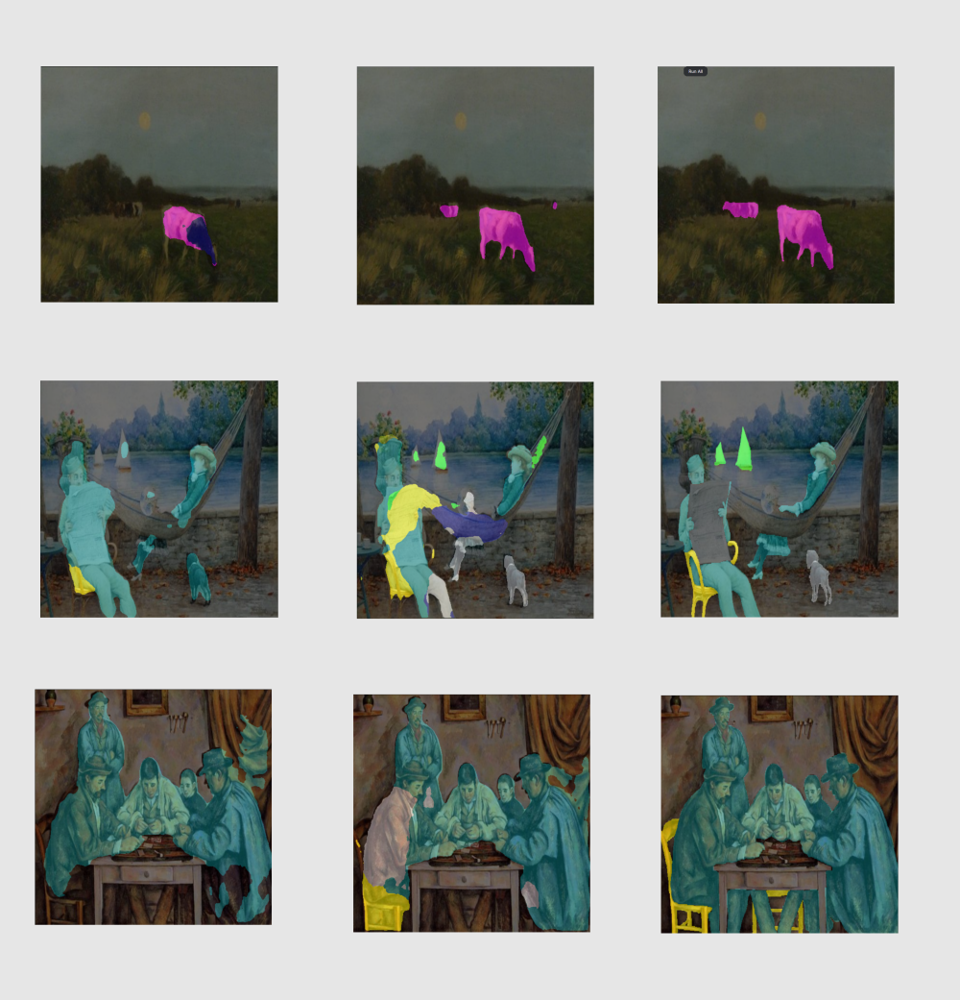

# Semantic Segmentation of Fine Art Paintings using Transformers

Data preparation was adopted from [Cohen et al](https://github.com/Nadavc220/SemanticSegmentationInArtPaintings). The
training dataset was generated by transferring the style from paintings to realworld
images. As there are many labelled datasets for segmentation, a lot more
training data is available this way. The SegFormer model was fine-tuned on this
data. Afterwards, the inference was conducted on paintings from different art
movements.

## Data

The pascal_sbd_styled folders were used as input in training and contain pseudo paintings: https://www.kaggle.com/datasets/vidrebol/art-seg-ready/data

Initial data before style transfer process (DRAM,PASCAL and SBD): https://www.kaggle.com/datasets/vidrebol/art-seg/data

Test data: https://www.kaggle.com/datasets/vidrebol/dram-test/data

Instructions for downloading SBD and PASCAL VOC 2012 datasets are available here: https://github.com/Nadavc220/SemanticSegmentationInArtPaintings

## Models

The following models were fine-tuned on the training dataset: 

SegFormer: https://huggingface.co/nvidia/segformer-b0-finetuned-ade-512-512

MaskFormer: https://huggingface.co/facebook/maskformer-swin-tiny-ade

## Results

| Model variant  | mIoU | 
|-------|-----|
| SegFormer | 0.2003  | 
| SegFormer+jitter   | 0.2025  | 
| MaskFormer+jitter   | 0.2697  | 

Values were compared between training on transformed data with and without color jitter.

Background is the most represented
class in the database, hence the prediction is the most successful. The label sheep
proved to be the most difficult to predict for SegFormer, while MaskFormer
had difficulties with predicting cat pixels. This was the only category in which
SegFormer was more accurate. MaskFormer attained
considerably better results than SegFormer across all other categories.

Comparison of predictions: SegFormer predictions are on the left and
MaskFormer predictions are in the center. Ground truths are presented on the
right. In the first row, SegFormer correctly predicts a part of one cow, while it
assigns the head’s cow to the label horse. MaskFormer correctly recognizes both
cows and even marks one in the distance, which may be an unlabelled cow patch.
In the second row a challenging example with four labels is presented. SegFormer
classifies almost all entities as persons and roughly recognizes the chair. Mask-
Former’s behaviour is erratic, however more classes are labelled correctly. In the
third row, SegFormer only labels persons and MaskFormer falsely assigns a part
of the person as a dog, while predicting also a part of a chair correctly.
